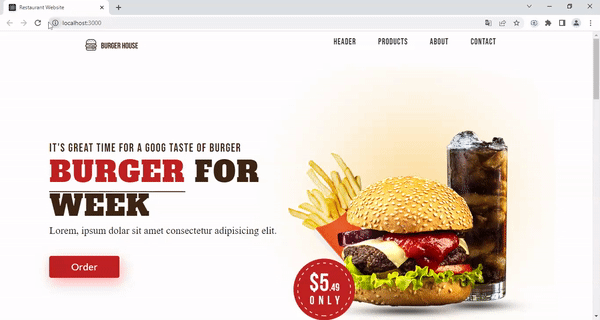

<h1>Responsive React JS Restaurant Website</h1>

<h3>Kullanıla Teknolojiler</h3>

<h3>ReactJS - HTML5 - CSS3</h3>

*<b>Javascript</b> de <b>React</b> kütüphanesi kullanılarak dinamik ve responsive bir restorant web sitesi tasarlandı. 
*<b>React Hooks</b> yapılarından<b> "useState && useEffect"</b> fonksiyonları kullanılarak <b>React DOM</b> üzerinde çalışmalar yapıldı. 
*<b>Responsive</b> bir görünüm için <b>CSS de media etiketleri</b> çağrılarak<i>"Bilgisayar && Tablet && Telefon" </i>ekranlarda tarayıcıda uygum saplayacak bir görünüm kazandırıldı. 

